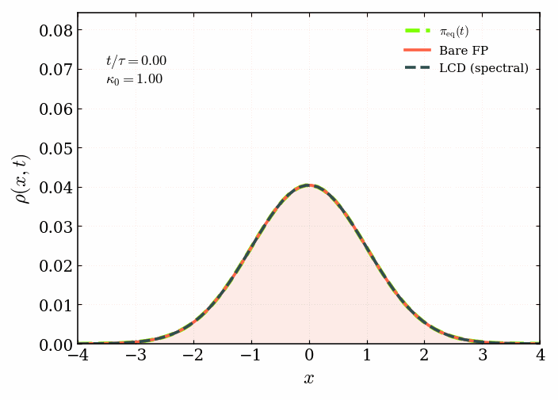
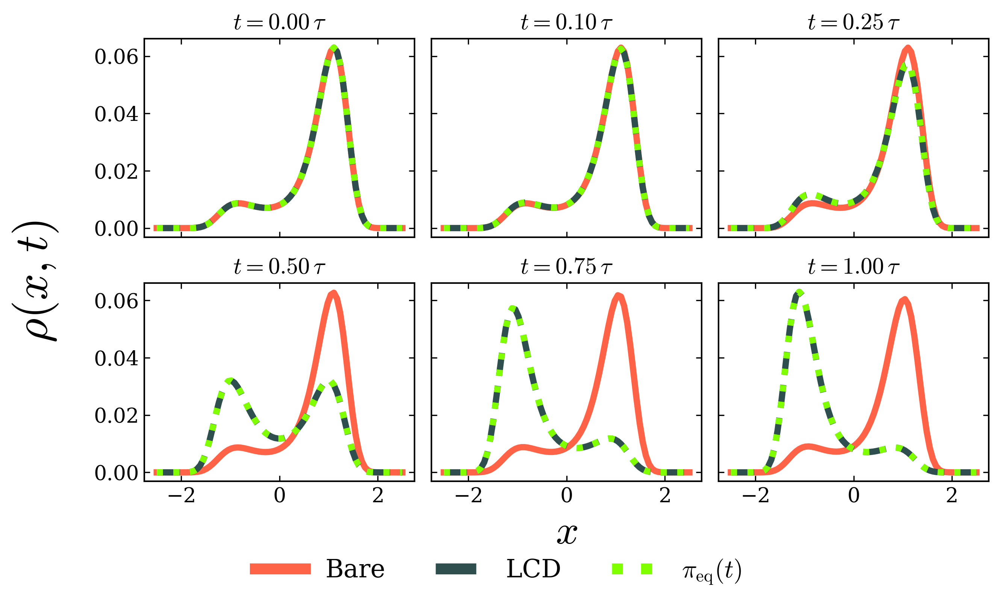

# Stochastic Counterdiabatic Driving via Biorthogonal Liouvillian Eigenmodes

Biorthogonal-decomposition-based **Liouvillian counterdiabatic driving (LCD)** for
the Fokker–Planck / master-equation dynamics, integrated with a
4th-order Magnus scheme. Benchmarked against bare (uncontrolled)
dynamics and, where available, an exact analytic counterdiabatic
solution — across a well-conditioned double well and harmonic trap, and
a deliberately adversarial "stress test" potential designed to probe
where our spectral method breaks down.

<p align="center">
  
</p>

Harmonic trap, $$\tau = 0.1$$ : as the trap stiffens ($\kappa_0$: 1→4), bare Fokker–Planck
dynamics (red, filled) persistently lags behind the narrowing
instantaneous equilibrium (dashed, green), while both LCD-driven dynamics
(dashed) track it almost exactly throughout — right up to the end of a
deliberately fast protocol.

<p align="center">
  
</p>

Double well, $\tau=0.1$: the same story in static form, at six points along
the anneal.

---

## What this is

For a system with a time-dependent potential $V(x,\zeta(t))$, evolving
under overdamped Fokker–Planck dynamics, exact counterdiabatic driving
would require full knowledge of the (generally intractable) continuum
generator. This repo implements a **discrete, spectral** version:
the Liouville operator/rate-matrix generator $\hat{\mathbf{L}}(t)$ is diagonalized at every step via
its biorthogonal (left/right) eigenvectors, and a correction counterdiabatic term  is added to the bare dynamics so that the driven distribution tracks the
instantaneous equilibrium either perfectly or imperfectly (if truncated to fewer spectral modes) than bare
relaxation alone.

Three systems are studied:

| System | Potential | Protocol | Notes |
|---|---|---|---|
| **Double well** | $V(x,\zeta)=x^4-2x^2+\zeta x$ | $\zeta:-1\to1$ | well-conditioned; LCD reaches machine precision |
| **Harmonic trap** | $V(x,t)=\tfrac12\kappa_0(t)x^2$ | $\kappa_0:1\to4$ | also has an **exact analytic CD** solution (scalar variance ODE) to benchmark against |
| **Quartic coalescence** (stress test) | $V(x,\zeta)=x^4-16(1-\zeta)x^2$ | $\zeta:0\to1$ | deliberately adversarial: symmetric double well with an exponentially closing spectral gap as $\zeta\to0$ |
---
Diagnostics tracked throughout: 

1. $\mathrm{TVD}(\rho,\pi_{\text{eq}})$
   
total variation distance

3. $\mathcal{D}_{\text{KL}}$
   
Kullback-Leiber divergence between the time-evolved $\rho(t)$ and the instantaneous equilibrium distribution $\pi_{\text{eq}}(t)$

4. $\mathcal{W}_{\text{diss}}(t) = \mathcal{W}(t) - \Delta \mathcal{F}(t)$
   
excess dissipated work

## Repository structure

```
biorthogonal_fpe/
├── src/
│   ├── Lcd_full_magnus4.py            core physics (see below)
│   ├── plotter.py                     PRL-style plotting: tvd/kl/wdiss/landscape
│   ├── spectral_diagnostics.py        fine-resolution diagnostics (see below)
│   ├── plot_spectral_diagnostics.py   plot-only companion (no recompute)
│   ├── run_diagnostics_for_T.py       re-run spectral_diagnostics.py at any (T, dt)
│   ├── plot_truncation_series_all.py  plot-only, auto-discovers every computed T
│   ├── symmetric_gauge_verification.py  validated dense-vs-symmetric-tridiagonal speedup
│   ├── eigendecomposition_verification.py  L(t)=D(t)Lambda(t)D^-1(t) verification + matrix plots
│   ├── harmonic_tau_sweep.py          W(tau) vs tau (harmonic trap)
│   ├── harmonic_animation.py          animated rho(x,t): bare vs LCD vs analytic CD
│   ├── free_energy_diff.py            quartic stress-test: W(tau) vs tau sweep
│   ├── quartic_diagnostics.py         quartic stress-test: potential + spectral gap
│   └── results/                       bundled example output (see "Bundled results")
├── notebooks/
│   └── demo.ipynb                     tour of every system's key figures
├── requirements.txt
└── pyproject.toml
```

### `Lcd_full_magnus4.py` — core physics

The module every other script imports (`import Lcd_full_magnus4 as sim`).
Import-safe: importing it never triggers a simulation.

- **Integrators**: `magnus4_step` (4th-order Magnus, used for LCD/spectral
  dynamics), `midpoint_step` (2nd-order, used for bare dynamics)
- **Biorthogonal decomposition**:
  - `biorthogonal_decomp(L, N)` — dense `np.linalg.eig`, the reference
    implementation used throughout the main pipeline
  - `biorthogonal_decomp_sym(L, pi, N)` — **faster, opt-in** alternative
    exploiting detailed balance: $L$ satisfies
    $L_{ij}\pi_j = L_{ji}\pi_i$ by construction, so
    $L_{\rm sym}=D^{-1/2}LD^{1/2}$ ($D=\mathrm{diag}(\pi_{\rm eq})$) is
    real symmetric *and* tridiagonal, letting
    `scipy.linalg.eigh_tridiagonal` replace the dense nonsymmetric
    solve — verified ~12–14x faster per call at $N=80$, with
    eigenvalues/eigenvectors agreeing with the dense solve to
    $10^{-8}$–$10^{-13}$ (see `symmetric_gauge_verification.py`). Not
    wired into the main pipeline by default — every existing result in
    this repo used the dense solve; this is provided as a validated,
    drop-in-compatible option for anyone who wants the speedup.
- **Counterdiabatic generator**: `build_ACD_from_L(...)`, with optional
  `n_trunc` to keep only the $n$ slowest-decaying modes (truncated LCD)
  and an optional `decomp_cache` to reuse one biorthogonal
  decomposition across an $n_{\rm trunc}$ sweep at fixed $L(t)$
- **Metrics**: TVD (inline, `0.5*|rho-pi|.sum()`), KL divergence
  (`kl_divergence`)
- **Per-potential model + dynamics**: `build_L_dw`/`build_L_harm`,
  `run_dw`/`run_harm` (bare or LCD), and — for the harmonic trap only —
  `run_harm_analytic`, the **exact** analytic CD solution via a scalar
  variance ODE (no spatial discretization, no biorthogonal
  decomposition at all)
- **Sweep/study drivers**: `run_sweep` (T-sweep across both potentials,
  writes `sweep_summary.md`), `run_truncation_study` (scalar
  max-TVD/KL/Wdiss vs $n_{\rm trunc}$, at a coarser dt for speed)

### `spectral_diagnostics.py` — fine-resolution diagnostics

Six-plus figure types per potential, at a much finer $dt$ than the main
sweep, all following the same compute-once/plot-many split as the rest
of this repo:

1. **Spectral gap**: $1/|\lambda_n(t)|$ for the 5 slowest modes
2. **$r_0(t)$ vs $\pi_{\rm eq}(t)$**: verifies the zero eigenvector of
   $\hat{\mathbf{L}}(t)$ equals the instantaneous Boltzmann distribution at *every* t,
   not just $t=0$ — a structural property of detailed balance, not a
   coincidence
3. **TVD / KL / $\mathcal{W}_{\rm diss}$ vs $t/\tau$**: bare vs LCD (vs analytic,
   for the harmonic trap)
4. **$\rho(x,t)$ snapshots**: bare vs LCD vs $\pi_{\rm eq}$ at 6 points
   along the anneal
5. **Truncated-mode series**: TVD/KL/$W_{\rm diss}$ time series at
   several $n_{\rm trunc}$ values against the full solution, showing
   how many modes are actually needed for convergence

**Important**: the excess dissipated work $\mathcal{W}_{\text{diss}}(t) = \mathcal{W}(t)- \Delta \mathcal{F}(t)$
here is computed via a **Simpson power integral**,
$\mathcal{W}(t)=\int_0^t \dot{\lambda} \langle\partial_{\lambda} V \rangle_{\rho(s)}\,ds$
via `scipy.integrate.cumulative_simpson` — *not* the coarser
midpoint-rule heat-integral bookkeeping used internally by
`Lcd_full_magnus4.run_dw`/`run_harm`. The latter is accurate at the
$O(1)$ dissipation scale (fine for bare dynamics) but introduces a
spurious mid-protocol bump when the true dissipation is within a few
orders of magnitude of machine precision (as LCD's is) — this was
diagnosed and fixed here; see `wdiss_refined`'s docstring for the full
derivation and the rejected alternative that was tried first.

### Quartic coalescence — a stress test, not a success story

`free_energy_diff.py` and `quartic_diagnostics.py` study
$V(x,\zeta)=x^4-16(1-\zeta)x^2$: a symmetric double well at $\zeta=0$
(barrier height 64, in units where $\beta=1$) that coalesces into a
single well by $\zeta=1$. The barrier height is
$\Delta V_b(\zeta)=64(1-\zeta)^2$, and the slowest relaxation mode's
gap closes **exponentially**,
$|\lambda_1(\zeta)|\sim\exp[-\Delta V_b(\zeta)]$ (Kramers/Eyring
scaling — verified numerically in `docs/quartic_coalescence_section.tex`).
Below $\zeta\approx0.33$–$0.4$ the true gap is smaller than
double-precision machine epsilon and is no longer numerically
resolvable at all.

Because the counterdiabatic coefficient $c_1\sim1/\lambda_1$ diverges
exactly where the correction is most needed, LCD here delivers only a
modest ~15–50$\times$ improvement over bare dynamics — not the
9–12 orders of magnitude seen for the double well and harmonic trap.
**This is the expected, intended result**: the model exists to show
where the method's assumptions break down, not to demonstrate another
success case.

### `eigendecomposition_verification.py` — $\mathbf{L}(t) = \mathbf{D}(t)\boldsymbol{\Lambda}(t)\mathbf{D}^{-1}(t)$

Directly verifies exact diagonalization of the Liouville generator for
both the double well and harmonic trap, at six points along each
anneal: the reconstruction residual
$\epsilon_{\Lambda}= |D^{-1} L D-\Lambda|_{\infty}$ and the
biorthogonality residual $\epsilon_I= |D^{-1} D-I\|_\infty$ both sit
at floating-point precision throughout ($10^{-7}$–$10^{-15}$). Also
produces matrix-plot figures — $L(t)$ itself alongside the
reconstruction-residual heatmap, at each snapshot — for both
potentials. Full derivation and tables in
`docs/eigendecomposition_verification_section.tex`.

### `harmonic_animation.py` — animated $\rho(x,t)$

Captures a fine-grained (150-checkpoint) trajectory and renders it as
an animated GIF: bare Fokker–Planck dynamics vs LCD vs the exact
analytic CD solution, evolving against the instantaneous equilibrium as
the harmonic trap stiffens ($\kappa_0$: 1→4) over a deliberately fast protocol
($\tau=0.1$) — the animation at the top of this README.

---

## Installation

```bash
git clone <this-repo>
cd biorthogonal_fpe
pip install -r requirements.txt
```

Needs `numpy`, `scipy`, `matplotlib` (developed against numpy 1.26,
scipy 1.13, matplotlib 3.9; any reasonably recent versions should
work — nothing exotic is used beyond `np.linalg.eig`,
`scipy.linalg.eigh_tridiagonal`, `scipy.linalg.expm`,
`scipy.integrate.solve_ivp`/`cumulative_simpson`).

---

## Quickstart

All scripts write into `results/data/<folder>/` and
`results/plots/<folder>/` **relative to their own location**, so run
them from inside `src/` (or adjust `sim.DATA_ROOT`/`PLOTS_ROOT`).

```bash
cd src

# Main double-well / harmonic-trap experiment at T=0.5, dt=1e-4
python Lcd_full_magnus4.py

# T-sweep across both potentials (writes results/data/sweep_summary.md)
python Lcd_full_magnus4.py --sweep

# Fine-resolution diagnostics (all 6+ figure types) at a given (T, dt)
python run_diagnostics_for_T.py 0.1 1e-5

# Fast re-plot after tweaking plot style, no recompute
python plot_spectral_diagnostics.py

# Harmonic trap: Delta_F^est(tau) vs tau, log-log
python harmonic_tau_sweep.py

# Quartic coalescence stress test
python free_energy_diff.py       # W(T) vs Delta_F sweep
python quartic_diagnostics.py    # potential landscape + spectral gap

# Validate the symmetric/tridiagonal biorthogonal_decomp_sym speedup
python symmetric_gauge_verification.py

# Verify L(t) = D(t) Lambda(t) D^-1(t) + matrix-plot figures
python eigendecomposition_verification.py

# Animated rho(q,t): bare vs LCD vs analytic CD (harmonic trap)
python harmonic_animation.py
```

**Runtime note**: `biorthogonal_decomp` calls a dense $O(N^3)$
eigendecomposition at every Gauss–Legendre node of every Magnus4 step —
this dominates runtime. At $N=80$, a run scales roughly linearly with
step count ($T/dt$); expect single-digit minutes for $T\sim0.1$,
$dt\sim10^{-5}$ and correspondingly longer for slower protocols or
finer $dt$. `run_truncation_study`/the truncated-mode series share one
biorthogonal decomposition across an entire $n_{\rm trunc}$ sweep at
fixed $(T,dt)$, since the decomposition doesn't depend on
$n_{\rm trunc}$ — an ~len(n\_list)$\times$ speedup for free.

---

## Bundled example results

`src/results/` ships a curated (not exhaustive) subset of pre-computed
output so the notebook works out of the box without a multi-hour
recompute:

- `DW_T_0.1_dt_1e-05/`, `harmonic_T_0.1_dt_1e-05/` — the full
  fine-resolution diagnostic set (all `spectral_diagnostics.py` figures)
- `harmonic_tau_sweep/` — summary table + plots (the bundled `.npy` is
  trimmed to just the final-value rows; rerun `harmonic_tau_sweep.py`
  for the full per-$\tau$ trajectories)
- `free_energy_smoke_test/`, `quartic_diagnostics/` — the quartic
  stress-test results
- `symmetric_gauge_verification/` — the dense-vs-symmetric speedup
  verification
- `eigendecomposition_verification/` — the $\mathbf{L}=\mathbf{D}\boldsymbol{\Lambda}\mathbf{D}^{-1}$
  verification tables + matrix plots
- `harmonic_animation/` — the animated $\rho(q,t)$ GIF at the top of this
  README (data-only; the underlying trajectory `.npy` is bundled too,
  so the GIF can be rebuilt/restyled without resimulating)

Every other $(\tau,dt)$ combination explored during development (the main
$\tau$-sweep at coarser $dt$, additional $\tau$ points, etc.) is
regeneratable via the scripts above but isn't bundled here to keep the
repo lean.

---

## Notebook

`notebooks/demo.ipynb` walks through the bundled results for all three
systems — potential landscapes, bare vs LCD vs analytic comparisons,
spectral gaps, truncation convergence — calling the *same* plotting
functions listed above (not reimplementing anything), loading from the
bundled `results/` data so it runs in seconds rather than hours.

---

## Known gaps / things not (yet) in this repo

- There is no dedicated $W(\tau)$  vs $$\tau$$ sweep
  script for the double well analogous to `harmonic_tau_sweep.py` —
  the closest existing equivalent is the $$W_{\rm diss}$$ vs $$\tau$$ data in
  `Lcd_full_magnus4.run_sweep`'s `sweep_summary.md`, which covers the
  double well too but isn't presented as the same log-log
  $W$ figure.
- `biorthogonal_decomp_sym`'s speedup is validated but not adopted by
  the main pipeline (`build_ACD_from_L` still calls the dense solve) —
  swapping it in was out of scope here; see its docstring for exactly
  what would need to change.

---

## Reproducibility

All simulations were run in Python 3.9.25 with NumPy 1.26.4, SciPy
1.13.1, and Matplotlib 3.9.3. NumPy's dense eigendecomposition
(`numpy.linalg.eig`) — used throughout for the biorthogonal
decomposition of $\mathbf{L}(t)$ — was linked against OpenBLAS 0.3.23 (dynamic
architecture dispatch), which parallelizes the underlying LAPACK calls
across available cores. Wall-clock timings reported anywhere in this
repo (e.g. the dense-vs-symmetric-tridiagonal speedup benchmarks)
reflect this multi-threaded BLAS backend and the hardware below; expect
different absolute numbers on other machines, though the relative
scaling/speedup trends should hold generally.

Computations were run on a dual-socket workstation: 2× Intel Xeon
Platinum 8468 (48 cores/socket, 2 threads/core; 192 logical CPUs total),
2 TiB RAM, Rocky Linux 9.8 (kernel 5.14.0-687.17.1.el9_8.x86_64).
CPU-only — no GPU acceleration is used anywhere in this repo.

---

## Citation / paper section
